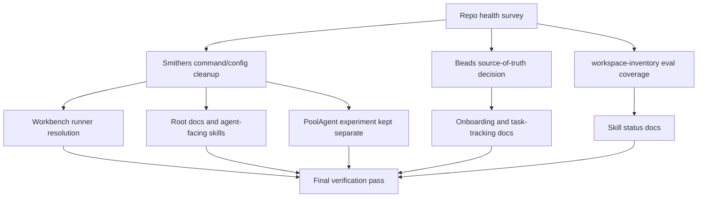

# chore: Stabilize skills repo operations

## Summary

Stabilize the skills repo by making the Smithers install match the current orchestrator model, making task-tracker ownership explicit, refreshing docs to reflect real skill and run status, and closing the `workspace-inventory` eval coverage gap. The work should preserve existing workflows and experiments unless a targeted check proves they are broken.

---

## Problem Frame

The repo already has the core strategy in place: validator-first Laguna skills,
deterministic artifacts, and workbench-backed eval evidence. The remaining
drift is operational: older Smithers command examples, unclear Beads ownership,
and status docs that lag current skill coverage. The plan should turn that
survey into a safe stabilization pass without silently rewriting project
history.

---

## Requirements

**Smithers operations**

- R1. Repo-facing Smithers instructions use `bunx smithers-orchestrator ...` unless the file is a local package script or an explicitly documented compatibility surface.
- R2. Root Smithers workflow health remains green for workflow discovery, starter discovery, and graph generation after command cleanup.
- R3. Workbench Smithers integration can resolve the workflow runner predictably, with a clear fallback or error path when local binaries are absent.
- R4. The PoolAgent experiment keeps its version and command surface separate from the root workflow pack unless a deliberate upgrade decision is made.
- R5. Root Smithers repo command hooks point at real repo checks or document why a hook is intentionally unset.
- R6. Workbench Smithers subprocesses preserve the current safety boundary: graph/verification operations run with scrubbed environments, while detached workflow runs keep only the environment access they require and document the risk.

**Task tracking and repo truth**

- R7. The repo documents whether Beads state is expected to live in this checkout, an external source, or only in graded `bead-selector` fixtures.
- R8. Stabilization does not run tracker initialization or copy `.beads` from another checkout without an explicit source-of-truth decision.
- R9. Onboarding and workbench docs distinguish external Beads source skills from repo-local `skills/bead-selector` eval truth.
- R10. External Beads source paths used by onboarding are either verified and documented or handled with an explicit missing-source message.

**Docs and eval status**

- R11. Public repo docs classify all current skills, including `bead-selector`, and keep `workspace-inventory` marked WIP until eval coverage and replay pass.
- R12. `workspace-inventory` has at least three eval cases, including one adversarial case, and a suite that passes both structural checks and dry-run replay.
- R13. Eval and optimization evidence remains described as internal and directional unless backed by current live run artifacts.
- R14. `workspace-inventory` validation covers the skill contract for lexicographically sorted `entries[]` or the docs explicitly remove that contract.

---

## Key Technical Decisions

- KTD1. Standardize agent-facing commands on `bunx smithers-orchestrator`, not raw `smithers`. Smithers docs now present `smithers-orchestrator` as the durable install and MCP command; raw `smithers` remains acceptable only where a package-local binary is intentionally in scope, such as `.smithers/package.json` scripts.
- KTD2. Treat root Smithers and `experiments/smithers-pool` as separate surfaces. The root workflow pack is on `smithers-orchestrator@0.23.x`; the experiment is older and should be verified with its own scripts before any normalization.
- KTD3. Preserve seeded Smithers workflow internals unless verification points to a specific break. `.smithers/workflows/*.tsx` already imports `smithers-orchestrator`; the drift is mainly generated skills, prompts, docs, and runner resolution.
- KTD4. Make Beads ownership a documented decision before changing behavior. This checkout lacks `.beads`, and another checkout has different remote and HEAD state, so copying or initializing tracker state would hide a product/process choice inside a cleanup patch.
- KTD5. Close `workspace-inventory` with real fixture coverage before changing its status language. The schema and validator exist, so the remaining blocker is representative cases and suite registration.
- KTD6. Configure root Smithers repo commands from existing checks rather than inventing new checks. Use `lint` for fast structural/schema/eval-case validation, `test` for validator robustness and smoke replay, and keep `coverage` unset unless a real coverage command exists.
- KTD7. Separate Smithers subprocess environment policy by operation. Graph and verification paths should use scrubbed environments because they execute generated workflow code; detached `up` runs may need credentials, so any fallback must make that inheritance visible and avoid expanding it accidentally.
- KTD8. Treat `workspace-inventory` sorting as part of the contract. If `entries[]` must be sorted lexicographically, the validator and evals should enforce it before the skill leaves WIP.

---

## High-Level Technical Design

The stabilization pass should keep each decision lane independent until final verification. Smithers command cleanup should not imply a PoolAgent experiment upgrade. Beads documentation should not imply tracker initialization. `workspace-inventory` docs should not move from WIP to supported until the eval check passes.

---

## Scope Boundaries

### In Scope

- Root Smithers command hygiene in `.agents/skills/smithers-*/SKILL.md`, `.smithers/prompts/*.mdx`, `.smithers/smithers.config.ts`, `.mcp.json`, `docs/smithers.md`, `README.md`, `CLAUDE.md`, and `AGENTS.md`.
- Workbench runner behavior around Smithers graph/run operations in `ui/lib.ts` and existing UI/bench tests.
- Documentation of Beads source-of-truth expectations in repo docs and onboarding/workbench docs.
- `workspace-inventory` eval cases and suite registration.
- Status doc updates that follow verified repo behavior.

### Deferred to Follow-Up Work

- Rewriting or deleting existing Smithers workflows.
- Migrating the PoolAgent experiment to a newer Smithers version unless its own verification shows the upgrade is needed for this stabilization.
- Initializing `.beads` or copying tracker data into this checkout.
- Publishing eval lift claims from workbench results.
- Refactoring workbench UX outside Smithers runner/status surfaces.

---

## Implementation Units

### U1. Baseline Operational Truth

- **Goal:** Capture current command, check, and status behavior so later edits can be judged against observed repo truth.
- **Requirements:** R2, R4, R8, R13.
- **Dependencies:** None.
- **Files:** None expected.
- **Approach:** Record the expected current state in the implementing agent's run notes, not as committed status docs: root Smithers doctor/list/starters are healthy, graphing a root workflow works, core structure/schema/validator checks pass, and eval-case checks fail only because `workspace-inventory` has no cases. Verify the PoolAgent experiment through its package scripts separately from the root workflow pack.
- **Patterns to follow:** The repo already keeps high-level agent guidance in `AGENTS.md` and detailed procedure in `docs/smithers.md` and `ui/README.md`.
- **Test scenarios:** Test expectation: none -- this is a characterization and documentation baseline, not a behavior change.
- **Verification:** A reviewer can trace every later doc/status claim to local check output, Smithers workflow health, or existing repo artifacts.

### U2. Repair Root Smithers Command and Config Drift

- **Goal:** Make all root agent-facing Smithers surfaces teach the modern orchestrator command and expose useful repo command hooks.
- **Requirements:** R1, R2, R4, R5.
- **Dependencies:** U1.
- **Files:** `.agents/skills/smithers-*/SKILL.md`, `.smithers/prompts/*.mdx`, `.smithers/smithers.config.ts`, `.mcp.json`, `.smithers/package.json`, `docs/smithers.md`, `AGENTS.md`, `README.md`, `CLAUDE.md`.
- **Approach:** Replace root agent-facing prose examples that tell agents to invoke raw `smithers` with `bunx smithers-orchestrator`. Do not churn generated frontmatter fields such as `requires_bin` or binary-relative `command` unless the Smithers generator source supports that change; instead, document or allowlist those fields if they are generated command-reference metadata. Configure `.smithers/smithers.config.ts` from existing repo checks: `lint` should cover fast structural/schema/eval-case validation, `test` should cover validator robustness and smoke replay, and `coverage` should stay unset unless a real coverage command exists. Verify `.mcp.json` still uses `bunx smithers-orchestrator --mcp`. Keep `.smithers/package.json` scripts on the package-local binary only if the docs name that as a local script exception; otherwise align the scripts too. Do not rewrite `.smithers/workflows/*.tsx` imports or workflow bodies unless graph verification fails.
- **Patterns to follow:** `AGENTS.md` and `docs/smithers.md` already state the root command policy; use them as the canonical wording.
- **Test scenarios:**
  - Happy path: searching agent-facing Smithers docs finds `bunx smithers-orchestrator` for CLI examples and no unqualified raw command examples outside the allowlist.
  - Edge case: package-local script references and generated frontmatter command metadata remain allowed only when docs or drift checks name them as intentional.
  - Config path: Smithers repo command hooks expose real checks or make intentional omissions visible to future agents.
  - MCP path: `.mcp.json` still registers `bunx smithers-orchestrator --mcp`.
  - Integration: root workflow doctor, workflow list, starters, and graph generation still succeed after edits.
- **Verification:** Root Smithers documentation, generated skills, prompt text, and repo command hooks agree on the command contract, while workflow discovery remains healthy.

### U3. Harden Workbench Smithers Runner Resolution

- **Goal:** Make the workbench robust when invoking Smithers graph/run operations, without depending on a fragile single local path.
- **Requirements:** R1, R2, R3, R6.
- **Dependencies:** U2.
- **Files:** `ui/lib.ts`, `ui/bench.ts`, `ui/bench-cli-contract.test.ts`, `ui/bench-invalid-flags.test.ts`, `ui/bench-unknown-help.test.ts`, `ui/bench.mirror-routes.test.ts`, `ui/server-node-artifacts-validation.test.ts`, `docs/smithers.md`, `ui/README.md`.
- **Approach:** Keep the current local-bin preference for speed and offline behavior, but add a documented resolver path or clearer error that points to `bunx smithers-orchestrator` setup when local binaries are unavailable. Keep graph/verification operations on a scrubbed environment. For detached workflow runs, preserve only the credentialed environment behavior required for existing runs and document the difference so a fallback does not accidentally broaden token exposure.
- **Patterns to follow:** `ui/lib.ts` owns shared project discovery and subprocess helpers; `ui/bench.ts` exposes JSON CLI contracts; existing bench tests assert stable command behavior.
- **Test scenarios:**
  - Happy path: with `.smithers/node_modules/.bin/smithers` present, workflow graph and run entrypoints use the local binary and preserve current behavior.
  - Error path: with no local Smithers binary discoverable, workbench surfaces a clear setup/remediation message instead of a generic failure.
  - Safety path: graph fallback uses a scrubbed environment, while detached run fallback has an intentional credential policy covered by tests or documented behavior.
  - Integration: bench CLI contract tests still pass for project discovery, workflow listing, and route metadata after runner resolution changes.
- **Verification:** Workbench Smithers operations are predictable on a fresh checkout and continue to work on the current checkout.

### U4. Document Beads Source of Truth

- **Goal:** Document the current Beads state and make any ownership decision explicit instead of implicit.
- **Requirements:** R7, R8, R9, R10.
- **Dependencies:** U1.
- **Files:** `README.md`, `AGENTS.md`, `docs/getting-started.md`, `ui/README.md`, `ui/views/onboard.js`, `skills/bead-selector/SKILL.md`, `evals/suites/skill-bead-selector.json`.
- **Approach:** Add a small task-tracking section that states the current observed state: `.beads` is absent in this checkout, repo-local behavior is graded through `skills/bead-selector`, and external Beads sources used by onboarding must be checked for availability and identity. If the owner decides Beads should be repo-owned, record that as a separate approval-gated follow-up before initializing or restoring `.beads`.
- **Patterns to follow:** Keep `AGENTS.md` short and move detailed procedure to docs. Use `README.md` only for status and entry points.
- **Test scenarios:**
  - Happy path: a new agent can read docs and tell whether `br`/`bv` should work in this checkout.
  - Edge case: docs do not point at a different checkout as the implicit authority.
  - Error path: if external Beads source paths are missing, onboarding or docs surface a clear missing-source state.
  - Integration: onboarding text and skill catalog/eval text agree about the relationship between external Beads skills and repo-local `bead-selector`.
- **Verification:** No repo doc implies that `.beads` exists locally unless the tracker was intentionally initialized as separate work.

### U5. Add `workspace-inventory` Eval Coverage

- **Goal:** Turn `workspace-inventory` from schema-plus-validator WIP into a skill with minimum eval coverage.
- **Requirements:** R11, R12, R13, R14.
- **Dependencies:** U1.
- **Files:** `skills/workspace-inventory/evals/<case-id>/prompt.md`, `skills/workspace-inventory/evals/<case-id>/input/`, `skills/workspace-inventory/evals/<case-id>/expected/`, `skills/workspace-inventory/evals/<case-id>/metadata.json`, `evals/suites/skill-workspace-inventory.json`, `skills/workspace-inventory/scripts/validate_workspace_inventory.ts`, `skills/workspace-inventory/SKILL.md`; conditional: `evals/suites/smoke.json`.
- **Approach:** Add at least three cases that exercise the existing validator contract: a small flat workspace, a nested workspace with `.laguna` excluded and symlink handling visible, and an adversarial case that fails on incorrect counts, missing entries, or unsorted `entries[]`. Update the validator if needed so lexicographic ordering is enforced when the skill contract requires it. Add a dedicated suite first; add one smoke case only after the dedicated suite passes dry-run replay and the case is cheap enough for smoke. Bump the skill version if prose, schema, or validator content changes.
- **Patterns to follow:** Existing skill eval directories under `skills/ci-log-reducer/evals/`, `skills/laguna-task-contract/evals/`, and `skills/repo-map/evals/`; `scripts/check_eval_cases.py` for required case shape.
- **Test scenarios:**
  - Happy path: a valid `.laguna/workspace-inventory.json` with correct `total_files`, entries, and directory file counts passes validation.
  - Edge case: `.laguna` contents and symlink targets are excluded according to the skill procedure.
  - Error path: an adversarial artifact with missing entries, mismatched counts, or unsorted entries produces a failing validator result without crashing the harness.
  - Integration: repo-wide eval-case checks pass, and the dedicated suite passes dry-run replay with expected artifacts copied into the fixture workspace.
- **Verification:** `workspace-inventory` satisfies the minimum case count and adversarial-case requirement, the dedicated suite replays successfully, and docs can describe its status based on passing local checks.

### U6. Refresh Repo Status Docs

- **Goal:** Make the public docs honest about current skills, Smithers, Beads, and eval status after the operational fixes land.
- **Requirements:** R1, R4, R7, R11, R13.
- **Dependencies:** U2, U3, U4, U5.
- **Files:** `README.md`, `docs/README.md`, `docs/getting-started.md`, `docs/eval-methodology.md`, `docs/smithers.md`, `docs/plans/laguna-skills-v0-2026-06-10.md`, `CLAUDE.md`, `AGENTS.md`.
- **Approach:** Update the current-status narrative after behavior is verified. Classify `bead-selector` as a real skill with rough evals. Before U5 verification passes, keep `workspace-inventory` marked WIP; after it passes, classify it as minimum eval-covered unless another named blocker remains. Mark the v0 plan as a historical plan of record with current deltas rather than the full live status.
- **Patterns to follow:** `docs/reviews/documentation-audit-2026-06-12.md` already separates factual drift from future improvements; use that style rather than making broad marketing claims.
- **Test scenarios:**
  - Happy path: the skill list in docs matches the catalog surfaced by the workbench.
  - Edge case: docs preserve internal/directional wording for eval evidence and do not promote workbench numbers into publishable claims.
  - Integration: links and referenced commands point to existing files and current root Smithers command policy.
- **Verification:** A reader starting from `README.md` can understand which skills are publish-track, which are WIP, how Smithers is installed, and why Beads may not be locally initialized.

---

## System-Wide Impact

This work touches three agent-facing surfaces: command skills under `.agents/skills/`, Smithers workflow prompts under `.smithers/prompts/`, and the workbench runner path in `ui/lib.ts`. The highest risk is not runtime breakage; current Smithers health is good. The risk is making docs and generated skills disagree, which would send future agents down the wrong command path.

The eval change affects repo-wide quality gates because `scripts/check_eval_cases.py` currently fails only for `workspace-inventory`. Once that gap closes, future failures should signal real drift rather than known WIP debt.

---

## Risks & Dependencies

- **Smithers version churn:** Root Smithers is older than current docs/changelog entries. Mitigation: clean command drift first, then evaluate a version bump as a deliberate sub-step with workflow doctor/list/graph verification.
- **Local-bin versus `bunx` behavior:** Workbench currently prefers local binaries. Mitigation: preserve local-bin fast path and only add a fallback or clearer error with tests around both cases.
- **Subprocess token exposure:** Smithers graph and run operations currently have different environment needs. Mitigation: keep graph/verification scrubbed, document run-time credential inheritance, and test any fallback by operation type.
- **Beads ownership ambiguity:** Initializing tracker state would make the checkout look authoritative without a decision. Mitigation: document the chosen authority before changing tracker state.
- **Experiment drift:** `experiments/smithers-pool` is intentionally older than the root pack. Mitigation: verify it separately and avoid broad version normalization.
- **Eval case fragility:** New `workspace-inventory` cases can overfit one filesystem shape. Mitigation: use small fixtures that exercise counts, exclusions, and adversarial validation separately.

---

## Acceptance Examples

- AE1. Given a fresh agent reads the repo docs, when they look for Smithers commands, then root workflow instructions consistently point to `bunx smithers-orchestrator ...` and explain any package-local exception.
- AE2. Given `.beads` is absent in this checkout, when an agent reads task-tracking docs, then they can tell whether that is expected state or a setup gap without running tracker initialization.
- AE3. Given `workspace-inventory` eval cases are added, when repo-wide eval-case validation and dedicated suite dry-run replay run, then they no longer fail for missing coverage, adversarial gaps, or broken expected artifacts.
- AE4. Given the workbench invokes a Smithers graph operation, when the local binary is available, then the existing behavior remains; when it is unavailable, the user gets a clear setup path.

---

## Documentation Plan

Docs should be updated last, after runtime and eval checks establish the new truth. Keep `AGENTS.md` as an index and move procedural details into `docs/smithers.md`, `docs/getting-started.md`, or `ui/README.md`. Update `README.md` for reader-facing status only, not low-level command troubleshooting.

---

## Sources & Research

- `AGENTS.md` for repo non-negotiables, Smithers command policy, and check expectations.
- `README.md` for current skill status and known `workspace-inventory` WIP language.
- `docs/smithers.md` for root Smithers install history and workbench integration notes.
- `.mcp.json` for MCP registration using `bunx smithers-orchestrator --mcp`.
- `.smithers/smithers.config.ts` for currently empty repo command hooks.
- `.smithers/package.json` for local workflow-pack scripts and root Smithers dependency.
- `ui/lib.ts` for current Smithers binary discovery and graph/run subprocess behavior.
- `scripts/check_eval_cases.py` for minimum eval case and adversarial coverage rules.
- `skills/workspace-inventory/SKILL.md`, `skills/workspace-inventory/schemas/workspace-inventory.schema.json`, and `skills/workspace-inventory/scripts/validate_workspace_inventory.ts` for the ready-to-cover skill contract.
- `docs/reviews/documentation-audit-2026-06-12.md` for prior documentation drift findings.
- [Smithers installation docs](https://smithers.sh/installation), [Smithers agent docs](https://smithers.sh/agents/overview), and [Smithers 0.24.0 changelog](https://smithers.sh/changelogs/0.24.0) for current external command and version context.
