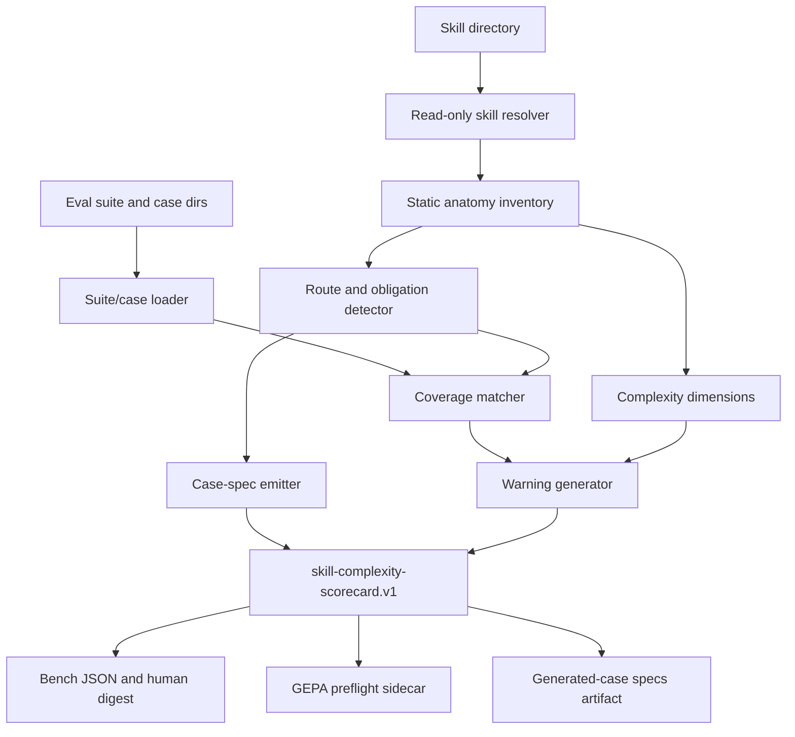
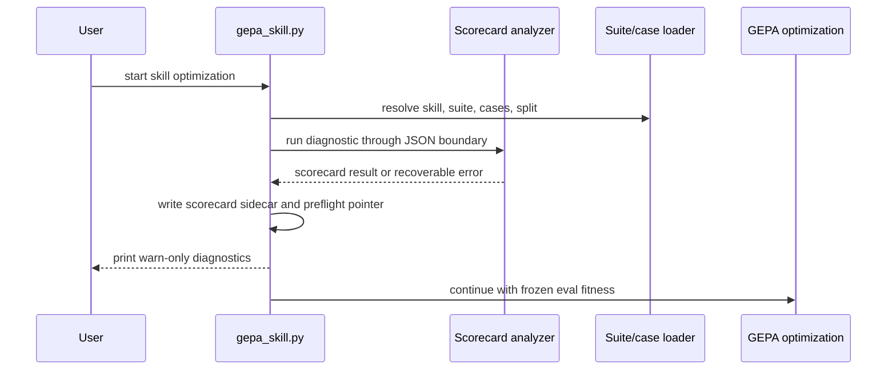

# feat: Add Skill Complexity Scorecard

## Summary

Add a pre-GEPA Skill Complexity Scorecard that analyzes skill route complexity, supporting artifacts, documentation quality, eval coverage, and bootstrap-ready case-spec gaps. The scorecard will be available as a standalone bench/CLI diagnostic and as a fail-open GEPA preflight that writes machine-readable diagnostics without changing optimization fitness or generated-case promotion rules.

---

## Problem Frame

Large skills can look GEPA-ready while hiding many user-facing routes, procedural branches, references, scripts, validators, and negative-control obligations behind a small eval suite. The current repo already has strong gates for skill structure, eval cases, generated candidates, and GEPA frozen surfaces, but it lacks a preflight that tells authors whether the selected suite gives enough route-level signal before model calls are spent.

The plan preserves the origin document's diagnostic-only posture: the scorecard explains low-signal risk and emits candidate case specs, but generated cases still enter the existing quarantine, validation, review, and promotion path.

---

## Requirements

### Scorecard analysis

- R1. Detect user-facing routes or flows and assign each a route count contribution, confidence label, documentation-quality label, and evidence.
- R2. Report supporting dimensions for skill length, reference fanout, script/tool fanout, asset fanout, validator/schema surface, documentation quality, agent ergonomics, and procedural branch density.
- R3. Compare detected routes against a selected eval suite and mark route coverage as `covered`, `weakly_covered`, or `uncovered`.
- R4. Assess whether matched eval cases provide useful static pass/fail signal and explanatory-feedback potential for optimization.
- R5. Distinguish long but linear skills from route-complex skills with weak coverage or poor supporting documentation.
- R6. Emit a split advisory when independent high-confidence routes suggest one skill may be doing multiple jobs, without splitting anything automatically.

### GEPA preflight

- R7. Run and display the scorecard before GEPA optimization when preflight is enabled and a target skill/suite has been resolved.
- R8. Warn when route count materially exceeds useful route coverage, or when matched cases appear too broad to provide route-level optimization signal.
- R9. Keep scorecard output diagnostic-only; GEPA continues optimizing against the selected eval and validator fitness.
- R10. Keep v1 warn-only and fail-open so a scorecard warning or analyzer failure does not block an optimization run.

### Eval bootstrapping

- R11. Emit atomic eval-case specs for missing or weak routes only when route confidence is high enough to support bootstrapping.
- R12. Emit atomic specs for clearer cross-cutting obligations such as false-trigger boundaries, artifact contracts, CLI/tool ergonomics, and validator behavior.
- R13. Each emitted spec names the target route or obligation, bucket, scenario, required artifact behavior, confidence evidence, documentation-quality evidence, and optimization-signal rationale.
- R14. Feed emitted specs into the generated-case pipeline rather than writing directly into the frozen eval corpus.
- R15. Avoid claiming a spec is a valid eval case until mechanical gates and the selected review mode accept it.

### Usability, trust, and automation

- R16. Explain every warning with actionable evidence a skill author can use before GEPA.
- R17. Mark uncertain route detections low confidence and keep them advisory.
- R18. Distinguish high-confidence but poorly documented routes from low-confidence route guesses.
- R19. Present findings as digestible atomic warnings and route rows, not a wall of prose.
- R20. Allow a curated reference-skill bank to inform structural comparison without treating reference skills as Laguna ground truth.
- R21. Emit a stable, schema-validated, machine-readable result with deterministic route IDs, warning IDs, spec IDs, artifact paths, and lifecycle states for GEPA, bench, CI, and agent consumption.
- R22. Keep analyzer and bench paths non-interactive and read-only by default, with structured partial-failure status when analysis cannot complete.

---

## Scope Boundaries

### In scope for v1

- Standalone scorecard analysis for a repo skill name or skill directory path, resolved read-only without importing or copying external skills by default.
- Optional suite-aware coverage matching when a suite is supplied or discoverable.
- Bootstrap-compatible case-spec emission as data inside the scorecard result and as an optional separate artifact.
- GEPA warn-only preflight integration that records diagnostics in the optimization run directory.
- Golden fixtures and contract tests for deterministic output, confidence labels, coverage matching, spec emission, and fail-open preflight behavior.

### Deferred for later

- Automatic skill splitting or rewrite suggestions that modify skill files.
- Treating scorecard scores as GEPA fitness, candidate selection, or release evidence.
- Automatic promotion of generated eval cases.
- Perfect route detection across every imported prompt style.
- A large curated reference bank beyond a small documented v1 allowlist.

### Deferred to Follow-Up Work

- Adding explicit route IDs to `eval-case.v1` metadata. V1 should avoid changing the frozen eval metadata contract and rely on evidence-backed matching.
- Browser UI visualization for scorecard rows. V1 can land the bench/CLI and JSON substrate first.
- Interactive route confirmation before generation. V1 should make pre-review possible above the analyzer, not part of the core non-interactive contract.

---

## Key Technical Decisions

- KTD1. **Use a Python harness analyzer as the canonical implementation.** The scorecard needs direct access to skill directories, suites, case metadata, prompts, references, and GEPA run directories; the existing harness already owns those contracts. A TypeScript bench command should wrap the analyzer rather than reimplement scoring logic.
- KTD2. **Resolve skills read-only.** Repo skill names resolve under `skills/<name>/`; external skill directories are analyzed in place unless a separate import workflow is invoked. The scorecard must not reuse mutation-capable bootstrap behavior that copies external skills into the repo.
- KTD3. **Make structured JSON the source of truth.** The canonical artifact is `skill-complexity-scorecard.v1`; human summaries, bench output, and GEPA warnings render from that result. This prevents GEPA and agents from scraping markdown prose.
- KTD4. **Encode lifecycle and artifacts in data.** The schema should include invocation metadata, analysis status, partial-failure errors, artifact manifest entries, and candidate-spec lifecycle fields so consumers do not infer state from logs.
- KTD5. **Detect routes conservatively from skill anatomy.** High-confidence routes require explicit trigger, procedure, artifact, validation, or reference evidence. Vague examples and incidental prose can produce low-confidence findings, but not bootstrap-ready specs.
- KTD6. **Treat eval coverage matching as static, evidence-backed advisory analysis.** Existing eval metadata has no route field, so matching should use case IDs, metadata notes, prompts, expected artifact paths, and input fixture names. Static coverage and observed optimization-signal quality should be separate fields so preflight does not overclaim runtime feedback quality.
- KTD7. **Emit generator-compatible specs without changing `eval-case.v1`.** Case specs should keep generator-owned fields top-level and put scorecard-only details under `scorecard_context`. They are not eval cases until the existing gates accept and promote them.
- KTD8. **Integrate with GEPA through a fail-open JSON boundary.** GEPA should invoke the analyzer as a subprocess-style JSON contract or similarly minimal dependency boundary, write `scorecard.json`, point diagnostics to that sidecar, and continue if the analyzer warns or crashes.
- KTD9. **Keep automation behavior non-interactive by default.** The analyzer should not prompt, mutate skills, or promote cases. Exit codes and result schema should support CI, bench, GEPA, and agent orchestration.

---

## High-Level Technical Design

### Scorecard data flow



The analyzer produces one structured result. Downstream surfaces choose how much to render, but none of them reinterpret route confidence, coverage, spec eligibility, or artifact lifecycle from prose.

### GEPA preflight sequence



The preflight sits after skill and suite resolution so coverage analysis has real case paths, and before smoke, baseline, or optimization spend so warnings are visible early.

### Stable result contract

The result schema should define these contract areas without requiring consumers to parse human prose:

| Area | Stable fields |
| --- | --- |
| Identity | `schema_version`, `skill`, `skill_path`, `suite`, `generated_at`, `analyzer_version`, `threshold_profile_version` |
| Invocation | resolved input type, read-only resolution mode, requested artifact paths, and consumer surface |
| Status | `analysis_status`, `partial`, structured `errors`, and recoverable warning state |
| Artifacts | manifest entries with kind, schema version, repo-relative or run-relative path, and purpose |
| Summary | `complexity_level`, `route_count`, coverage counts, warning count, `split_advisory` |
| Dimensions | per-dimension `value`, `level`, `evidence`, and threshold label |
| Routes | deterministic `id`, `label`, `confidence`, `documentation_quality`, `evidence`, `coverage`, `matched_cases` |
| Warnings | deterministic `id`, `severity`, `confidence`, affected route/spec IDs, message, evidence, recommended next action |
| Case specs | generator-compatible fields plus `candidate_spec_only` lifecycle state and namespaced `scorecard_context` |

---

## Output Structure

```text
harness/analyze/
  skill_complexity_scorecard.py
schemas/common/
  skill-complexity-scorecard.v1.schema.json
tests/
  test_skill_complexity_scorecard.py
  fixtures/scorecard/
    long-linear-skill/
    multi-route-skill/
    low-doc-route-skill/
    cross-cutting-obligation-skill/
```

Existing files in `ui/`, `harness/optimize/`, and `docs/` will be modified rather than moved.

---

## Implementation Units

### U1. Scorecard data model and bench surface

- **Goal:** Define the stable result contract and expose the standalone diagnostic through the workbench CLI without implementing route heuristics yet.
- **Requirements:** R2, R16, R19, R21, R22; supports F1 and F2.
- **Dependencies:** None.
- **Files:** `schemas/common/skill-complexity-scorecard.v1.schema.json`, `harness/analyze/skill_complexity_scorecard.py`, `scripts/check_schemas.py`, `ui/bench.ts`, `ui/lib.ts`, `ui/bench-invalid-flags.test.ts`, `tests/test_skill_complexity_scorecard.py`, `ui/README.md`.
- **Approach:** Add result dataclasses or equivalent structured builders in the analyzer and validate emitted JSON against the new schema. The schema should cover invocation, analysis status, structured errors, artifact manifest entries, lifecycle state, deterministic IDs, and threshold profile versioning. Add a bench command named explicitly for skill complexity, such as `skill-complexity-scorecard`, with strict flag handling for skill, suite, JSON output, and optional specs output. Keep stdout machine-readable and put human-readable warnings on the same structured payload rather than a separate text-only mode.
- **Patterns to follow:** `ui/bench.ts` command catalog and bespoke parser patterns for `eval-case-generate`; `tests/test_gen_eval_cases_cli_contract.py` schema-validation style; `schemas/common/eval-case.v1.schema.json` for enum and `additionalProperties` discipline.
- **Test scenarios:**
  - Given a minimal fixture skill, running the analyzer returns `schema_version: skill-complexity-scorecard.v1` and validates against the schema.
  - Given duplicate scalar bench flags, the bench parser rejects the invocation before launching the analyzer and suggests close known flags.
  - Given `--json-out` and `--specs-out`, the analyzer writes addressable artifacts and includes them in the artifact manifest while stdout remains valid JSON.
  - Given an output path under `skills/<skill>/evals/` or `evals/suites/`, the scorecard rejects the specs artifact path before writing.
  - Given a missing skill, the command returns a structured error and does not create output artifacts.
  - Given the same fixture twice, route IDs, warning IDs, spec IDs, and artifact IDs remain deterministic.
- **Verification:** The standalone command is discoverable in bench help, emits schema-valid JSON, rejects invalid flags consistently with other bench commands, and has no implicit file mutation outside requested output paths.

### U2. Skill anatomy extraction

- **Goal:** Build a deterministic inventory of the skill's visible contract, supporting assets, and eval corpus surfaces.
- **Requirements:** R1, R2, R5, R18, R21, R22; supports F1.
- **Dependencies:** U1.
- **Files:** `harness/analyze/skill_complexity_scorecard.py`, `tests/test_skill_complexity_scorecard.py`, `tests/fixtures/scorecard/long-linear-skill/`, `tests/fixtures/scorecard/multi-route-skill/`.
- **Approach:** Parse `SKILL.md` frontmatter, required sections, trigger lists, procedure branches, output contract, validation, repair, escalation, examples, references, scripts, schemas, assets, and eval directories. Count fanout and branch signals separately so a long reference-heavy skill does not look like a route-heavy skill by default. Keep raw inventory as an internal analyzer model; publish only stable dimensions, route rows, warnings, specs, and artifacts in `skill-complexity-scorecard.v1`.
- **Execution note:** Add characterization fixtures for the authoring-guide skill shape before tuning thresholds.
- **Patterns to follow:** `docs/authoring-guide.md` section ordering and progressive-disclosure rules; `scripts/check_skill_structure.py` for structure expectations; `harness/runner/matrix.py` for suite/case loading posture.
- **Test scenarios:**
  - Covers AE2. Given a long but linear fixture with many examples and one workflow, the inventory reports high size/reference fanout but one clear route and no split warning.
  - Given a fixture with references, scripts, schemas, and evals, the dimensions count each surface once and include repo-relative evidence paths.
  - Given a missing optional `references/` directory, the analyzer reports zero reference fanout without error.
  - Given a malformed or missing `SKILL.md`, the analyzer returns a structured error or warning and does not crash the bench wrapper.
  - Given an external skill directory, the analyzer reads it in place and does not copy it into `skills/`.
- **Verification:** Inventory output is deterministic, uses repo-relative or input-relative evidence, and separates internal anatomy facts from public route judgments.

### U3. Route and documentation-quality heuristics

- **Goal:** Classify user-facing routes, cross-cutting obligations, documentation quality, branch density, agent ergonomics, and split-advisory signals from the anatomy inventory.
- **Requirements:** R1, R2, R5, R6, R16, R17, R18, R20; supports F1.
- **Dependencies:** U2.
- **Files:** `harness/analyze/skill_complexity_scorecard.py`, `tests/test_skill_complexity_scorecard.py`, `tests/fixtures/scorecard/multi-route-skill/`, `tests/fixtures/scorecard/low-doc-route-skill/`, `tests/fixtures/scorecard/cross-cutting-obligation-skill/`, `tests/fixtures/scorecard/reference-bank/`.
- **Approach:** Start with transparent thresholds and evidence labels: high confidence for explicit trigger/procedure/artifact/validation evidence, medium for distinct trigger or branch evidence, and low for examples or vague prose. Documentation quality should score the route's trigger, procedure, artifact contract, validation/repair path, and linked reference coverage separately from route confidence. Add the minimal opt-in reference-bank fixture or allowlist here so structural comparison can be tested as soon as route heuristics exist; keep it isolated from coverage and fitness decisions. Split advisory should require multiple high-confidence routes with distinct triggers and little shared procedure.
- **Patterns to follow:** Authoring-guide expectations for `Use when`, `Do not use when`, `Procedure`, `Output contract`, `Validation`, `Repair`, and `Escalation`; existing repo check scripts that emit actionable violations rather than hidden scores.
- **Test scenarios:**
  - Covers AE3. Given independent flows with distinct triggers and little shared procedure, the report emits a split advisory with evidence but does not suggest or perform a rewrite.
  - Covers AE4. Given an explicit trigger with weak artifact/procedure documentation, the route is high confidence and low documentation quality.
  - Given a vague example-only behavior, the route is low confidence and cannot emit a bootstrap-ready spec.
  - Given a strong `Do not use when` false-trigger boundary with no route, the analyzer records a cross-cutting obligation eligible for adversarial coverage analysis.
  - Given a reference bank configured with curated skills, structural comparison influences explanatory evidence but not Laguna ground truth or validator scores.
- **Verification:** Route rows explain why each label fired, uncertain routes remain advisory, and split guidance never mutates skill content.

### U4. Eval-suite coverage matching

- **Goal:** Match detected routes and obligations against existing eval cases without overclaiming coverage.
- **Requirements:** R3, R4, R8, R11, R17, R21; supports F1 and F2.
- **Dependencies:** U2, U3.
- **Files:** `harness/analyze/skill_complexity_scorecard.py`, `harness/runner/matrix.py`, `tests/test_skill_complexity_scorecard.py`, `evals/README.md`.
- **Approach:** Reuse `harness/runner/matrix.py` suite and case loading semantics so scorecard, bench, and GEPA do not drift on suite shape or invalid-case handling. Match with evidence from case folder names, metadata notes, prompts, expected artifact paths, and input filenames. Mark static coverage `covered` only when evidence connects the case to the route; record optimization-signal quality separately as `signal_assessment` with `static` or future `observed` mode.
- **Patterns to follow:** `harness/runner/matrix.py` non-throwing case loading; `evals/README.md` bucket and expected-status semantics; generated-case dedup and promotion discipline.
- **Test scenarios:**
  - Covers AE1. Given many high-confidence routes and a suite with only one broad case, uncovered and weakly covered routes produce low-signal warnings.
  - Given a route name that appears in a case prompt and expected artifact path, the route is covered with matched-case evidence.
  - Given only a generic realistic case with no route-specific evidence, the route is weakly covered rather than covered.
  - Given no observed GEPA run feedback, the result reports static signal assessment and does not claim observed feedback quality.
  - Given a missing or invalid suite, the analyzer reports suite-loading warnings and still returns skill anatomy results.
  - Given a case with `expected_status: fail`, the matcher treats it as useful only for the matching negative-control or out-of-scope obligation.
- **Verification:** Coverage decisions are reproducible, evidence-backed, and never require `eval-case.v1` schema changes in v1.

### U5. Bootstrap-compatible case-spec emission

- **Goal:** Emit atomic case specs for high-confidence uncovered or weakly covered routes and clear cross-cutting obligations.
- **Requirements:** R11, R12, R13, R14, R15, R19, R21; supports F3.
- **Dependencies:** U3, U4.
- **Files:** `harness/analyze/skill_complexity_scorecard.py`, `harness/generate/gen_eval_cases.py`, `tests/test_skill_complexity_scorecard.py`, `tests/test_gen_eval_cases_cli_contract.py`, `docs/external-skill-bootstrap.md`, `schemas/common/skill-complexity-scorecard.v1.schema.json`.
- **Approach:** Keep emitted specs as data in the scorecard result and optionally write a `case-specs.json` array for direct generator input. Use the generator's existing `slug`, `bucket`, `difficulty`, `expected_status`, `scenario`, and `target_gap` fields at top level, then add scorecard-specific details under `scorecard_context`. Mark each spec `candidate_spec_only` with allowed next actions, forbidden next actions, required review path, and `promotion_status: not_promoted`. Do not write under `skills/<skill>/evals/` or edit suites.
- **Patterns to follow:** `harness/generate/gen_eval_cases.py` explicit `--spec` path; `docs/external-skill-bootstrap.md` quarantine and promotion flow; `case-generation-result.v1` result shape for operation summaries.
- **Test scenarios:**
  - Covers AE5. Given an emitted spec, passing it through the generator path produces a quarantined candidate rather than a promoted eval case.
  - Given a specs output path inside the frozen eval corpus or suite directory, the analyzer refuses to write it and returns a structured error.
  - Given a high-confidence uncovered route, the result includes one atomic spec with route confidence, documentation-quality evidence, required artifact behavior, and signal rationale.
  - Given a low-confidence route, the result includes an advisory warning but no bootstrap-ready spec.
  - Given a false-trigger boundary obligation with no adversarial case, the emitted spec uses an adversarial bucket and explains the negative-control signal.
  - Given duplicate route/spec inputs, slug generation remains deterministic and avoids collisions with existing case IDs.
- **Verification:** Specs are generator-compatible, schema-valid inside the scorecard result, and clearly labeled as candidates that still require normal validation and review.

### U6. GEPA warn-only preflight

- **Goal:** Reuse the analyzer in GEPA so authors see low-signal risk before optimization begins.
- **Requirements:** R7, R8, R9, R10, R16, R21, R22; supports F2.
- **Dependencies:** U1, U4, U5.
- **Files:** `harness/optimize/gepa_skill.py`, `harness/analyze/skill_complexity_scorecard.py`, `ui/lib.ts`, `ui/bench.ts`, `tests/test_skill_complexity_scorecard.py`, `docs/gepa-optimization.md`.
- **Approach:** Invoke the analyzer after GEPA resolves the skill, suite, cases, and output directory through the same JSON contract used by bench or an equally minimal dependency boundary, then write `scorecard.json` in the optimization run directory. Include only the scorecard sidecar path, status, and compact diagnostic summary in GEPA config or workbench state; do not copy scorecard warning counts into candidate state, metric inputs, or fitness records. Analyzer exceptions should become structured preflight warnings and should not change GEPA's exit code unless another GEPA gate fails.
- **Patterns to follow:** `harness/optimize/gepa_skill.py` config sidecar pattern; frozen-path gate posture; `ui/lib.ts` optimize run sidecar handling; `docs/gepa-optimization.md` mutation-surface language.
- **Test scenarios:**
  - Covers AE1. Given a large under-covered skill, GEPA preflight writes a scorecard and prints low-signal warnings before proceeding.
  - Given a long but linear skill, GEPA preflight records size complexity without warning about route explosion.
  - Given an analyzer exception, GEPA records a preflight failure warning and continues to the same smoke or optimization outcome it would otherwise have produced.
  - Given scorecard warnings, GEPA still evaluates selected cases through frozen validator fitness and does not add scorecard fields to the optimizer metric.
  - Given workbench `optimize-skill`, the run state exposes the scorecard sidecar path without requiring the browser UI to parse stderr.
  - Given standalone and GEPA preflight runs over the same fixture, the shared core fields have identical semantics.
- **Verification:** Preflight is visible, fail-open, and diagnostic-only across raw GEPA and bench-launched optimization paths.

### U7. Golden fixtures, checks, and documentation

- **Goal:** Lock the analyzer contract with fixtures, update user-facing docs, and ensure broad repo checks understand the new schema and command surface.
- **Requirements:** R16, R19, R20, R21; verifies F1, F2, and F3 end to end.
- **Dependencies:** U1 through U6.
- **Files:** `tests/test_skill_complexity_scorecard.py`, `tests/fixtures/scorecard/`, `README.md`, `docs/gepa-optimization.md`, `docs/external-skill-bootstrap.md`, `ui/README.md`, `docs/eval-methodology.md`.
- **Approach:** Add golden fixture assertions for long-linear, multi-route, low-documentation, cross-cutting-obligation, and reference-bank cases. Document the standalone command, GEPA preflight behavior, generated-spec handoff, reference-bank limitations, and the limits of scorecard evidence. Keep docs clear that scorecard output is advisory and internal/directional.
- **Patterns to follow:** Existing Python unittest contract tests; `ui/bench-invalid-flags.test.ts` no-side-effect parser tests; README warnings that eval and GEPA results are internal and directional.
- **Test scenarios:**
  - Repeated runs over golden fixtures produce byte-stable IDs and stable warning/spec counts except for timestamp fields.
  - Schema checks include the new scorecard schema and fail on unknown enum values or missing required warning fields.
  - Documentation states that scorecard warnings do not block GEPA and scorecard specs do not bypass generated-case review.
  - The reference-bank fixture demonstrates structural comparison without changing complexity level solely because a curated reference differs.
  - Broad repo checks still pass for existing publish-ready skills that have no scorecard artifacts.
- **Verification:** Fixture tests, schema checks, bench parser tests, GEPA smoke coverage, and docs all reinforce the same advisory contract.

---

## System-Wide Impact

- **Generated-case lifecycle:** The feature adds a new upstream source of case specs, but the authoritative lifecycle remains `runs/generate/` candidates, mechanical gates, optional human review, and explicit promotion.
- **GEPA optimization lifecycle:** GEPA gains a preflight artifact and warning channel, but frozen evals, schemas, validators, candidate materialization, and fitness scoring remain unchanged.
- **Agent and CI consumption:** Stable JSON output lets agents and automation decide whether to generate cases, warn humans, or proceed with GEPA without scraping human prose.
- **Skill resolution:** External skills are analyzed read-only by default, so scorecard diagnosis does not silently import or modify source skills.
- **Workbench naming:** Existing workbench code already uses “scorecard” for eval lift. New symbols and command names should use `skill-complexity-scorecard` or `complexityScorecard` to avoid ambiguity.
- **Documentation posture:** Docs must repeat that the scorecard is not release evidence and cannot prove skill improvement.

---

## Risks & Dependencies

- **False precision in route detection:** Mitigate by requiring evidence for high-confidence routes and refusing to emit specs for low-confidence detections.
- **Coverage overclaiming:** Mitigate with weak coverage labels, matched-case evidence, and no v1 changes to eval metadata.
- **Generator contract drift:** Mitigate by keeping specs compatible with current generator fields and adding tests that pass emitted specs through the explicit-spec path.
- **GEPA coupling:** Mitigate by writing the scorecard as a sidecar and keeping all optimizer metric inputs unchanged.
- **Threshold disputes:** Mitigate by centralizing v1 thresholds as documented advisory constants and testing boundary examples.
- **Reference-bank misuse:** Mitigate by labeling curated skills as structural references only, never as Laguna ground truth or model-performance proof.
- **Analyzer dependency coupling:** Mitigate by keeping the GEPA integration on a minimal JSON boundary so scorecard dependencies do not make optimizer startup fragile.
- **Agent bypass risk:** Mitigate with candidate lifecycle fields, frozen-path output guards, and tests proving specs only enter generated-case quarantine.
- **Surface parity drift:** Mitigate with shared golden fixtures that compare core result semantics across standalone, bench, and GEPA preflight paths.

---

## Open Questions

### Resolved During Planning

- **Analyzer home:** Use Python harness tooling as the canonical analyzer because it already owns eval, generation, and GEPA contracts; wrap it from bench.
- **Case-spec format:** Keep generator-owned fields top-level, put scorecard-only context under `scorecard_context`, and write optional specs artifacts as JSON arrays; do not change `eval-case.v1` in v1.
- **GEPA behavior:** Use fail-open warn-only preflight and never feed scorecard values into GEPA fitness.
- **Route confidence and documentation quality:** Use explicit evidence tiers from skill anatomy in v1, then tune thresholds with golden fixtures.
- **Reference bank:** Use an opt-in fixture or allowlist for structural comparison only, not a live implicit scan of all skills.

### Deferred to Implementation

- Exact v1 threshold values for low, medium, and high complexity dimensions after the first fixture pass.
- Exact curated reference-bank entries after the opt-in fixture or allowlist mechanism is implemented in U3.
- Exact artifact-manifest field names after schema drafting, provided they preserve kind, path, schema version, and purpose.

---

## Acceptance Examples

- **AE1. Large route surface with thin coverage:** GEPA preflight warns that optimization may be low-signal, lists high-confidence uncovered or weak routes, and continues with the selected eval fitness.
- **AE2. Long but linear skill:** Standalone diagnosis reports size/reference complexity without route explosion or split recommendation.
- **AE3. Possible split candidate:** Independent flows produce an advisory split signal with confidence and evidence, but no automatic rewrite.
- **AE4. High-confidence but poorly documented route:** A clear trigger with weak artifact/procedure documentation remains high-confidence and low-documentation-quality, and emitted specs carry both labels.
- **AE5. Generated specs stay quarantined:** Emitted specs flow into generated-case validation and selected review before any promotion into the frozen eval corpus.

---

## Documentation / Operational Notes

- Update GEPA docs to show preflight output as a diagnostic artifact and to state that warnings are not optimization blockers.
- Update bootstrap docs to show how scorecard-emitted specs feed the explicit-spec generation path.
- Update workbench docs and command catalog so agents can discover the standalone diagnostic and its JSON output contract.
- Keep scorecard examples internal and directional; do not present complexity reduction as publishable model lift.

---

## Sources / Research

- `docs/brainstorms/2026-06-24-skill-complexity-scorecard-requirements.md` defines the scorecard, GEPA preflight, eval bootstrapping, and trust requirements.
- `docs/authoring-guide.md` defines skill anatomy, progressive disclosure, output contracts, validation, repair, and adversarial eval expectations.
- `docs/external-skill-bootstrap.md` defines generated-case quarantine, validation, review, and promotion flow.
- `harness/generate/gen_eval_cases.py` accepts explicit specs and materializes candidates through the existing gates.
- `docs/gepa-optimization.md` and `harness/optimize/gepa_skill.py` define GEPA's frozen eval contract and mutable component surface.
- `harness/runner/matrix.py`, `evals/README.md`, and `schemas/common/eval-case.v1.schema.json` define suite and case metadata contracts that v1 should not change.
- `ui/bench.ts`, `ui/lib.ts`, `ui/README.md`, and `ui/bench-invalid-flags.test.ts` define workbench CLI conventions, JSON output expectations, and parser tests.
- The supplied external research brief supports the premise that prompt optimization benefits from focused examples and textual diagnostic feedback, and that skill evals need explicit, implicit, contextual, and negative-control coverage.
