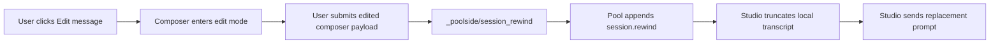

# ACP Rewind

## Goal

Add a Pool ACP rewind action to Studio so a user can return a chat to an earlier
user turn, edit or resend from that point, and continue the same Pool session
from the rewound context.

## Context

Pool ACP already exposes rewind as a Pool-specific extension:

- Capability: `_meta["poolside/rewind"] === true`
- Method: `_poolside/session_rewind`
- Request: `{ "sessionId": "...", "eventId": "..." }`
- Target event: the Pool trajectory `session.input` event id, surfaced to ACP
  clients through `_meta["poolside/inputEventId"]` on `session_info_update`

The Forge TUI uses this as an edit-from-history flow: it lets the user select a
previous user prompt, sends `_poolside/session_rewind`, and truncates the local
message list after the rewind point. Studio should follow the same protocol
shape, but use native chat controls instead of a TUI picker.

This is not chat forking. Pool rewind mutates the active server-side session by
adding a `session.rewind` event and masking the target input plus everything
after it from the active context. A future fork feature would need either ACP
`session/fork` support or a Pool-specific clone/replay contract.

## Product Shape

- Add a user-message action named `Edit message`.
- Place it in the existing hover action rail next to copy/timestamp actions on
  eligible user messages. The edit action appears to the left of copy.
- Show the action only when all of these are true:
  - selected runtime is Pool
  - Pool advertised `poolside/rewind`
  - the message has a stored `poolside/inputEventId`
  - the session is not currently prompting, waiting on permission, or replaying
- Clicking the action loads that message into the main composer and shows a
  compact edit-mode notice. It does not mutate the session until the user sends
  the composer payload.
- After the edited composer payload is submitted:
  - call Pool rewind for the original input event
  - remove the target user message and everything after it from the visible
    transcript
  - clear the active plan/work summary state that came after that point
  - send the composer payload as the replacement prompt in the same conversation
  - keep the user in the same conversation
- Show a compact failure toast if Pool rejects the rewind, the extension is not
  supported, or the target event is no longer rewindable.
- Show a compact composer-adjacent hint while editing: later messages will be
  replaced.

## UX Flow

1. User hovers a previous user message.
2. Studio shows an icon-only `Edit message` action.
3. User clicks the action.
4. Studio loads that message into the main composer and shows edit mode.
5. User edits and submits.
6. Studio disables the composer while the extension call is in flight.
7. Studio calls `_poolside/session_rewind` with the active Pool session id and
   the message's Pool input event id.
8. On success, Studio truncates the local transcript, updates persisted
   transcript/recovery state, and sends the composer payload as the next prompt.
9. The replacement prompt uses the same ACP session, now with Pool's active
   context rewound server-side.

## Technical Plan

- [ ] Capture Pool input event ids.
  - Move or share the `poolside/inputEventId` metadata key currently used by
    `src/lib/acp/turn-materializer.ts`.
  - Extend `MessageEvent` in `src/lib/acp/types.ts` with an optional
    `runtimeInputEventId` or Pool-specific equivalent.
  - Update `TurnMaterializer.applySessionInfoUpdate` to attach that value to
    the last user message when Pool sends `session_info_update`.
  - Keep the existing runtime metadata timestamp behavior.

- [ ] Add Pool rewind extension plumbing.
  - Add constants and payload parsing in
    `src/lib/chat/runtime/pool-extension-notifications.ts`.
  - Add a `rewindSelectedSessionToInputEvent(...)` method to
    `src/lib/chat/runtime/pool-extension-service.ts`.
  - Capability-gate the method on `_meta["poolside/rewind"]`.
  - Reject locally when the selected session is busy or has no backing Pool
    session id.
  - Call `connection.extMethod("_poolside/session_rewind", { sessionId, eventId })`.

- [ ] Add local rewind state mutation.
  - Add a `TurnMaterializer` helper that truncates events to just before the
    user message with the selected input event id.
  - Clear derived visible state that belongs to the removed tail: plan, work
    summary, pending assistant output, queued prompt state, and prompt-local
    indicators.
  - Persist the truncated transcript snapshot and recovery snapshot
    immediately after a successful rewind.
  - Persist the removed Pool input event ids and apply them as a replay mask on
    future `session/load` so old trajectory notifications stay hidden.
  - Keep raw trajectory/debug logs append-only where useful, but make the
    visible read model and persisted transcript match the rewound state.

- [ ] Expose the action through chat state.
  - Expose the existing narrow rewind method and normal prompt dispatch to the
    chat pane.
  - Project enough message-level UI state to the transcript to decide whether a
    user message is rewindable.
  - Pass an `onEditMessage` callback from the chat pane into
    `chat-transcript.svelte` and then into `chat-message.svelte`.

- [ ] Build the UI.
  - Extend `chat-message-copy-actions.svelte` or replace it with a small
    message-action cluster that can contain edit, copy, and timestamp.
  - Use a lucide edit icon such as `PencilLine` for the action.
  - Keep the action icon-only with an accessible label and tooltip.
  - Reuse the main composer for edited text, attachments, slash commands,
    skills, file search, and voice input.
  - Add a composer-adjacent edit notice with cancel.
  - Show an in-flight state and prevent double submission.

- [ ] Document behavior.
  - Update `ACP.md` with the Pool rewind extension, capability gate, local
    truncation behavior, and the fact that rewind does not revert workspace file
    changes.
  - Mention explicitly that this is same-session rewind, not chat fork.

## Edge Cases

- If the user edits after file edits, Studio should not imply the workspace is
  reverted. The composer notice should say later messages will be replaced, and
  a stronger file-change warning can be added later if needed.
- If a message predates `poolside/inputEventId` persistence, hide the action for
  that message.
- If Pool rejects a rewind because the event is compacted or unavailable,
  preserve the current transcript and show the runtime error.
- If a rewind is requested while a turn is active, disable the action rather than
  attempting to cancel and rewind in one step.
- If local persistence fails after Pool succeeds, prefer the server truth:
  resync/reload the session or show a recoverable error instead of pretending
  rewind did not happen.

## Open Questions

- Should the visible label be `Edit message` or `Edit from here`? Recommended:
  `Edit message`, because the user mental model is changing a sent message.
- Should the composer always be prefilled with the selected prompt after rewind?
  Yes. Prefer the main composer so editing gets the same attachments, skill
  insertion, file search, slash-command, and voice input behavior as a new
  prompt.
- Should Studio offer a top-level rewind picker later, similar to the TUI?
  Recommended: start with inline per-message actions and add a picker only if
  discoverability becomes a problem.
- Should file-change warnings become stronger when Studio can detect removed-tail
  workspace change summaries? Recommended: start with the generic composer hint,
  then add a stronger warning if later evidence shows users expect file rollback.

## Verification

- [ ] Unit test `TurnMaterializer` attaching `poolside/inputEventId` to user
      messages.
- [ ] Unit test transcript truncation before the selected user message.
- [ ] Unit test `PoolExtensionService` sends `_poolside/session_rewind` with
      `{ sessionId, eventId }` only when capability and session state allow it.
- [ ] Component test that edit action appears only on eligible Pool user
      messages and is hidden for unsupported runtimes/messages.
- [ ] Component or repository test that successful edit rewinds, persists the
      truncated transcript, and sends the replacement prompt.
- [ ] Repository regression test that replaying a rewound Pool trajectory keeps
      locally masked input ids hidden after navigation.
- [ ] `pnpm lint`
- [ ] `pnpm test -- tests/acp/session tests/ui/chat-transcript.test.ts`
- [ ] Manual smoke with repo-local Pool ACP: send several turns, edit an older
      user turn, submit it, and confirm later messages are replaced in the active
      context.

## Decision Log

**2026-05-28**: Treat rewind as a same-session destructive edit instead of a
fork because Forge Pool ACP implements `_poolside/session_rewind` by appending a
`session.rewind` event to the existing trajectory and masking later context.
Forking remains a separate future server capability.

**2026-05-28**: Use inline user-message actions for the first Studio UI because
the target of rewind is a specific Pool input event id, and inline controls make
that target explicit without introducing a separate picker surface.

**2026-05-28**: Use the main composer as the edit surface rather than a
transcript-local textarea so edited messages can reuse existing skill insertion,
file search, attachments, and voice input behavior.
